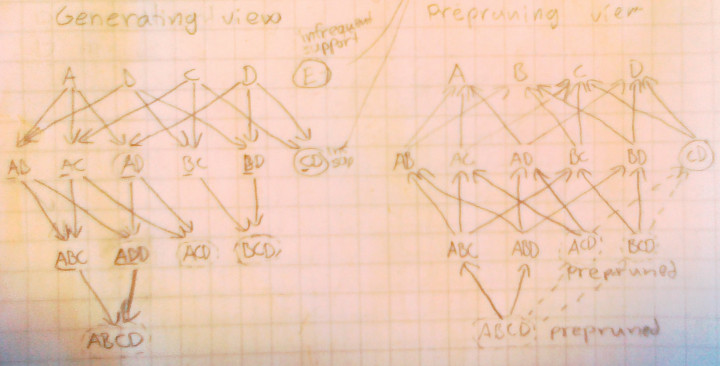

```{r, echo=FALSE}
# source('reportEnvironment.R'); build.report(c(1), do.pdf=TRUE);
```
.  

1. Report summary
-------------------


### 1.1. Substance

#### The problem

Analyse data about computer science courses. Try to find out how much taken courses differ from curricula recommendations. Is there academic freedom added to degree requirements?

#### The goal

The goal of this problem is to make you (very!) familiar with the concept of frequent itemset, including their search space, the Apriori algorithm for finding them, as well as practical use and implications of finding frequent itemsets in real data.

#### How did you approach the problem? What kind of choices did you make and why?

We started working on the problem by reading subchapters 6.1 and 6.2 from the book, and by choosing and setting up our collaboration and development tools. As our development tools, we chose to use the R programming language because most of us had at least some experience with it and it has a great association rule library called “arules”. As for collaboration, we put up an IRC channel along with a shared document in Google Docs for writing our report and keeping a “TODO” list.

After gaining some intuition on how the apriori algorithm’s frequent itemset generation works, we tried out the eclat tool and “arules” library on the course data set. We also calculated some basic statistics to gain insight on what kind of data we are working with. We also did some analysis on the effects of support threshold on the number of frequent itemsets (see part 3).

Some of us implemented the apriori algorithm frequent itemset generation part, which turned out to be more laborious to implement than what was first expected. Some of our conceptual thinking included things like this:

Apriori algorithm: first try to find all 1-itemsets that have the support which is larger than a defined threshold. Based on 1-itemsets, 2-itemset candidates are formed. Candidates whose supports are less than the threshold are pruned. The process is repeated until there is no itemset found.

Apriori using $F_{k-1}\times{}F_{k-1}$ Method: (1) candidate generation (2) candidate pruning (3) counting support from data. See the picture below. In generation phase always two (k-1)-itemsets are combined. In pruning step always k (k-1)-itemsets are checked for existence (already known to be frequent). We have to count supports from the data only for those itemsets that survived the pruning.



#### What kind of results did you get? What did you learn from them?

The data:

Courses are sparse,not evenly distributed, so it seems that there could be a pattern that follows curriculas? The algorithm outputs several combination of 1 course, 2 courses, etc that appear frequently. Time element is missing. Actual curriculum was not provided, so we cannot compare the frequent courses to curriculum.

The mean of the data element size tells that  on average the students took almost 12 courses (see report: reading the data and exploring it). Note that the element (itemset/transaction) length distribution sizes should go through 0-39 instead of 1-40. 12 courses means roughly 48 credit points per student.  The 2and and 3rd quarters of boxplot statistics tells that mostly students studied between 3 and 21 courses. The hardest working student of the data took 39 courses, that is approximately 156 credit points. From these numbers we can figure out that the data represents bachelor’s studies curriculums and most of the  students drop their studies roughly half way the bachelor’s studies.  

When we try to find frequent itemsets with eclat we get average 6,41 courses that student registered for.

In the report we drew a plot of what happens when support thresholds are 5%, 10% and 20%. (see from report: Reading the data in and exploring it). In the plot we can see how the number of frequent itemsets and the size of itemsets decreases when support threshold increases. That makes sense because the support measure eliminates uninteresting frequent itemsets that could be happening by chance. The median value of itemset’s size shifts from 8 to 4 respectively.

We also ran the apriori algorithm on the data and kept track of the candidates generated, pruned and supported. From this we learned that the pruning step of $F_{k-1}\times{}F_{k-1}$  method becomes more effective as k increases (see Arto’s last plot).

We mostly learned about how the algorithm works. To get more useful results, we probably would benefit from using more advanced concepts like association rules.

#### What kind of difficulties did you face?

We encountered technical problems and conceptual problems. Technical problems included that the Linux version of eclat is 32-bit and thus requires 32-bit libraries to work on a 64-bit Linux. Unfortunately the error message is very uninformative about this, and we needed to do some searching on the internet to find a solution. Running the command “ldd eclat” in the directory where the eclat tool exists should give you a list of libraries required. If using Ubuntu, the appropriate libraries can be installed with the command “sudo apt-get install ia32-libs”. Additionally even using existing software we ran out of memory when trying to set the support threshold too low (about 0.01 was the limit). In general, we expect that choosing the threshold can be problematic with large data.

We also found implementing our own versions of the Apriori algorithm harder than expected. And our own implementations were slow in general. Especially those implementations that did not use support()-function from the arules-library to calculate supports were slow. Reading the library documentation PDF revealed that they e.g. use prefix trees to store counters. Such a complex design is far beyond a simple “naive” implementation.

Conceptual problems included duplicates (13 lines out of 2401) in the data, conflicting data and README.txt, and the course book being rather short on the $F_{k-1}\times{}F_{k-1}$ method. From the course forum we found out that other people noticed the same things. Fortunately the lecture on thursday had a quiz about the pruning in $F_{k-1}\times{}F_{k-1}$ method that helped us understand it. Some of our thinking included:

Frequency that items appear on transactions is one measurement for the problem. We can see that the support as a joint probability. Let’s consider the following scenario. Assume that there is a course A which appears on 10% of registrations. The chosen threshold is 20%, so A is pruned away at the beginning. However all people registering for A take course B also, so in some sense, A is strongly related to B. In another scenario, the algorithm may find many non-meaningful patterns. Assume there is an obligated course C that every student has to take, so the support of C is 1. There are many combinations of C and other courses. We see that course C and those course are not really related. More precise, suppose there is course D whose support is 0.3 or P(D)=0.3. It’s easy to verify that C and D are uncorrelated, since P(C, D)=P(C)*P(D). If the threshold is 0.2, then {C, D} is considered a pattern even though they are linearly independent.

#### In hindsight, propose improvements to solving the problem.

Performance -wise many improvements could be made such as using the prefix trees to store the counters, implementing parts in C, using the strict vertical and horizontal ordering and using the implementation details of chosen data structures (for example the ngCMatrix sparse matrix implementation of the Matrix-library). How worthwhile we consider such an endeavour is an open question. Existing libraries seem to be performing reasonably well.

Concept-wise our thinking included: To avoid such situations described above I think of some heuristic methods. We can introduce an upper bound for frequency, weight frequent patterns, set a limit for numbers of patterns that a course or sub-pattern appears in. Again they are very heuristic, it’s hard to define good thresholds or penalties. Or instead of using the frequency (joint probability) as a measurement, we should use correlation between itemsets, but it’s can be costly.


### 1.2. Group learning:

#### What did you set as your learning objectives for this problem?
We had two main goals. First, to learn and thoroughly understand frequent itemsets and the apriori algorithm’s frequent itemset generation part. Second, to learn what this “problem based learning” is all about and how to go on about working and effectively communicating in this group-based manner.

#### How did you study and learn as a group?
While we did most of the reading alone, we used the lecture time slots (and one hour after them) and IRC to clarify concepts to each other that we didn’t grasp from the book immediately. IRC was also helpful for asking R-language and “arules”-library specific technical questions. We used Google Docs to collaborate on writing the report.

#### How did you divide and organize work in the group?
As this week’s problem wasn’t that large, everyone tried to do a bit of everything. Some more specialized tasks were done according to the interests of the individuals. For example, one of us could be working on analyzing the effects of different support threshold choices on the number and size of frequent/candidate itemsets, while others could work on interpreting and finding meaning in the results of the apriori algorithm.


### 1.3. Group self evaluation:

#### Did the group work well together? Why?
We found that we could communicate openly. We had previously met each other in the course “Introduction to Machine Learning”, so we weren’t complete strangers.

#### Did all group members contribute at least satisfactorily?
Yes. Of course because of time constraints, some could contribute more than others, but overall, everyone did their part.

#### How will you improve the way your group works?
Our group working seems to be improving organically quite well. Our quick analysis of improvement opportunities did not yield any clear candidates.


### 1.4. Evaluation of the problem and teaching:

#### Was the problem too large or too small? Was it too difficult or too easy? Too specific or too vague?
We found it positive that the task scaled well to how much time each individual could spend on it. The essence could be grasped quite fast, but there was also many opportunities to broaden and deepen the understanding. In that sense it was good that the problem definition was as vague as it was. Also being able to scale was especially important on this first week, because considerable effort was spent on getting all the group working infrastructure and processes going.

#### Did you have, as a group, suitable background to work on the problem?
For this week’s problem, we found that everyone in our group had enough prerequisite knowledge to understand and tackle the problem.

#### How could the problem description be improved (for the next course of later problems in this course)?
It would be nice to explicitly tell what chapters of the pages to read.

#### How could teaching be improved?
We found that this week’s lectures had too little time for group work.

### 1.5. Other comments, ideas, observations, feedback?
In general, we welcome at least trying out problem based learning.
